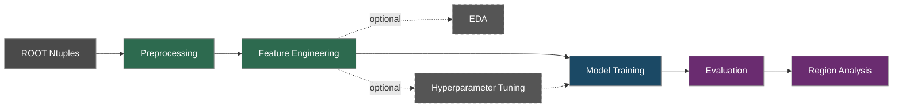

# Tau Supersymmetry

[](#ci)
[](https://www.python.org/)
[](https://hydra.cc/)
[](https://mlflow.org/)
[](https://dvc.org/)
[](https://docs.astral.sh/uv/)

Supersymmetry search with tau leptons in ATLAS data using machine learning for signal-background multi-class classification.

Built on ATLAS Run 2 data, this project implements a full ML pipeline — from ROOT ntuples to signal region optimisation — using XGBoost Boosted Decision Trees (BDTs) and PyTorch Deep Neural Networks (DNNs).

## Pipeline



| Stage | Command | Description |
|-------|---------|-------------|
| Preprocessing | `run.py stage=preprocess` | Selection cuts, event weights, sample merging |
| Feature Engineering | `run.py stage=feature_engineer` | Derived feature computation |
| EDA | `run.py stage=eda` | Exploratory data analysis and plots |
| Tuning | `run.py stage=tune` | Optuna hyperparameter optimisation with pruning |
| Training | `run.py stage=train` / `stage=train model=dnn` | XGBoost BDT or PyTorch DNN training |
| Evaluation | `run.py stage=evaluate` / `stage=evaluate model=dnn` | Metrics, confusion matrices, SHAP, ROC curves |
| Regions | `run.py stage=regions` | ML-based signal/control region analysis |

## Tech Stack

| Category | Tools |
|----------|-------|
| **Models** | XGBoost, PyTorch |
| **Tuning** | Optuna |
| **Evaluation** | scikit-learn, SHAP, pyhf |
| **Tracking** | MLflow |
| **Config** | Hydra |
| **Data** | uproot, awkward-array, pandas, Pandera |
| **Pipeline** | DVC |
| **Serving** | FastAPI, uvicorn |
| **Testing** | pytest, pytest-cov |
| **Linting** | mypy, Ruff, pre-commit hooks |
| **CI/CD** | GitHub Actions |
| **Deps** | uv |
| **Container** | Docker |

## Quick Start

**Requirements:** Python 3.13+ and [uv](https://docs.astral.sh/uv/)

```bash
# Clone and install
git clone https://github.com/<your-username>/tau-supersymmetry-search.git
cd tau-supersymmetry-search
make setup
```

## Usage

### Run the full pipeline

```bash
make pipeline                    # preprocess → train → evaluate
make repro                       # DVC-tracked reproducible run
```

### Run individual stages

```bash
make preprocess                  # ROOT ntuples → parquet
make train                       # Train BDT (default)
make train-dnn                   # Train DNN
make tune                        # Hyperparameter tuning
make evaluate                    # Evaluate BDT
```

### Model Serving

Start a REST API to serve predictions from a trained model:

```bash
# BDT server (default model)
uv run python run.py stage=serve

# DNN server
uv run python run.py stage=serve model=dnn
```

| Endpoint | Method | Description |
|----------|--------|-------------|
| `/v1/health` | GET | Health check |
| `/v1/model/info` | GET | Model metadata (features, classes) |
| `/v1/predict` | POST | Single-sample prediction |
| `/v1/predict/batch` | POST | Batch prediction |

```bash
# Example query
curl -X POST http://localhost:8000/v1/predict \
  -H "Content-Type: application/json" \
  -d '{"features": {"met": 250.0, "jet_n": 3}}'

# Interactive API docs
open http://localhost:8000/docs
```

### Override config via Hydra CLI

All stages support Hydra overrides via the unified entry point:

```bash
uv run python run.py stage=preprocess analysis.channel=2 regions@analysis=sr_ch2_compressed
uv run python run.py stage=train model.n_estimators=5000 seed=42
uv run python run.py stage=tune tuning.n_trials=200 model=dnn
```

### Experiment tracking

```bash
make ui                          # MLflow UI at http://localhost:5000
```

## Configuration

All configuration lives in `configs/` and is managed by [Hydra](https://hydra.cc/):

```
configs/
├── config.yaml          # Defaults and experiment name
├── model/               # xgboost.yaml, dnn.yaml
├── features/            # Feature sets per analysis scope
├── regions/             # SR, CR, VR definitions (17 configs)
├── samples/             # Background, signal, data sample lists
├── tuning/              # Optuna search spaces
├── merge/               # Sample merging strategies
├── pipeline/            # Processing workflow settings
├── run/                 # Run period configs (Run 2, Run 3)
├── data/                # I/O paths
└── paths/               # ROOT file path templates
```

Configs compose hierarchically — override any parameter from the command line without editing files.

## Project Structure

```
.
├── run.py                   # Unified entry point (Hydra stage dispatch)
├── configs/                 # Hydra YAML configs
├── src/
│   ├── pipelines/           # Pipeline stage orchestration
│   ├── processing/          # Cuts, merging, I/O, rectangularisation
│   ├── models/              # BDT, DNN, tuning, evaluation, splits
│   ├── eda/                 # Exploratory data analysis utilities
│   ├── regions/             # Signal/control region construction
│   ├── serving/             # FastAPI inference API
│   └── visualization/       # Plotting utilities
├── tests/                   # pytest suite
├── notebooks/               # Analysis notebooks (see below)
├── data/                    # Raw and processed data (DVC-tracked)
├── dvc.yaml                 # DVC pipeline definition
├── Dockerfile               # Container build
├── Makefile                 # Developer workflow
└── pyproject.toml           # Project metadata and tool config
```

## Notebooks

Step-by-step analysis walkthrough:

| # | Notebook | Description |
|---|----------|-------------|
| 00 | `overview` | Pipeline overview and data flow |
| 01 | `preprocessing` | Selection cuts and sample preparation |
| 02 | `feature_engineering` | Derived feature computation |
| 03 | `eda` | Distributions, correlations, class balance |
| 04 | `hyperparameter_tuning` | Optuna study analysis |
| 05a | `bdt_training` | XGBoost training and learning curves |
| 05b | `dnn_training` | PyTorch DNN training |
| 06a | `bdt_evaluation` | BDT performance, SHAP, ROC |
| 06b | `dnn_evaluation` | DNN performance analysis |
| 07 | `regions` | ML-based region optimisation |

## Data & Reproducibility

This project uses a split tracking strategy:

| Concern | Tool | What it tracks |
|---------|------|----------------|
| **Pipeline DAG** | DVC | Stage dependencies, cached intermediate outputs (`dvc repro`) |
| **Processed data** | DVC | Parquet dataframes derived from preprocessing and feature engineering |
| **Experiments** | MLflow | Hyperparameters, metrics, model artifacts, plots |

**Raw data:** The input ROOT ntuples (~1 TB) are produced by the ATLAS experiment. They are not version-controlled — preprocessing reads them as fixed, read-only inputs.

To reproduce the pipeline from existing processed data:

```bash
make repro                       # Re-run only stages whose deps changed
```

## Development

```bash
make test                        # Run tests with coverage
make lint                        # Ruff linter
make format                      # Pre-commit hooks (ruff, trailing whitespace, YAML check)
make clean                       # Remove caches
```

### Docker

```bash
make docker-build                # Build image
make docker-run                  # Run training in container
```

### CI

Every push and pull request to `main`/`dev` triggers:
1. Dependency installation (frozen `uv.lock`)
2. Code quality checks (pre-commit + Ruff)
3. Full test suite (pytest)
